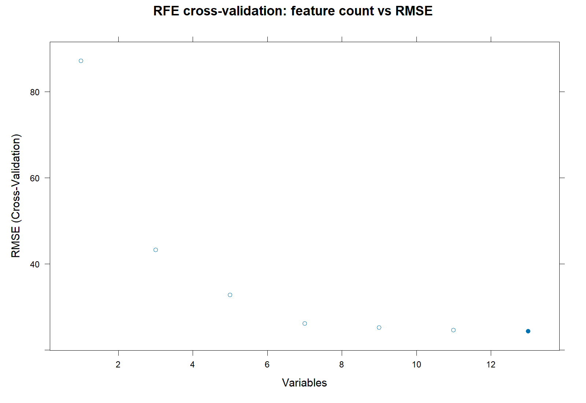

# 2001 model showcase

This page reports a previously saved 2001 run. It is a display record rather than a guarantee for a later rerun.

## Variable selection

RFE retained 13 predictors: `dem`, `bdod_0.5`, `clay_0.5`, `bio1`, `cfvo_0.5`, `bio12`, `sand_0.5`, `cec_0.5`, `silt_0.5`, `soc_5.15`, `phh2o_0.5`, `nitrogen_0.5`, and `lc`.

The selected-variable CSV and the RFE cross-validation table are in `showcase/2001/`.

## Independent-test accuracy

| Metric | Value |
|---|---:|
| RMSE | 22.6181 |
| MAE | 12.5829 |
| R2 | 0.9495 |
| Training rows | 56,673 |
| Independent test rows | 24,290 |
| mtry | 7 |
| Adaptive neighbours | 1,950 |
| Anchor models | 1,000 |

The table `showcase/2001/test_metrics.csv` is the machine-readable source for these values.

## Prediction scope

The corresponding model prediction covers Tibetan-Plateau LC 9/10 cells for 2001. The full GeoTIFF is intentionally not included in this public code repository because it is a large data product rather than a lightweight display asset. A map preview should be regenerated locally from the saved GeoTIFF with the documented R workflow before public release.

## Interpretation

This historical run selected `soc_5.15`; the reusable pipeline's current candidate universe uses `soc_0.5`. RFE is annual and data-dependent, so this showcase must not be treated as the fixed variable combination for other years.

